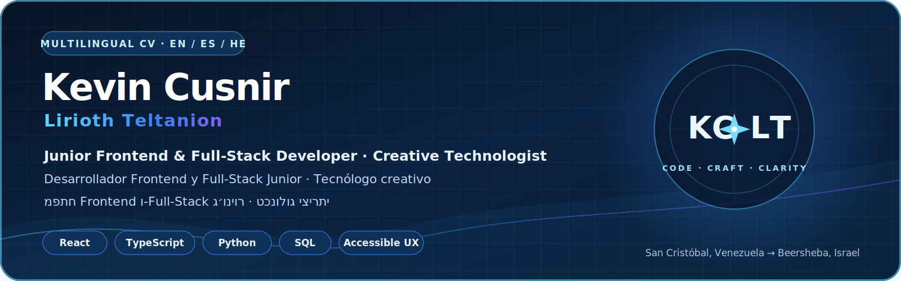

  

# Kevin Cusnir — Curriculum Vitae

**Junior Frontend & Full-Stack Developer · Creative Technologist**

Beersheba, Israel  
Email: [kevincusnir@gmail.com](mailto:kevincusnir@gmail.com)  
GitHub: [LiriothTeltanion](https://github.com/LiriothTeltanion)  
LinkedIn: [Kevin Cusnir](https://www.linkedin.com/in/kevin-cusnir-883173b4/)

## Professional summary

Junior frontend and full-stack developer building React, TypeScript, Python and SQL products with accessible multilingual UX, data honesty and practical automation. My work spans local-first music analytics, a deployed PostgreSQL learning platform and tested desktop software. **Lirioth Teltanion** is my creative identity for projects connecting engineering with music, visual storytelling and experimental interfaces.

## Core skills

- **Languages:** TypeScript, JavaScript, Python and SQL
- **Frontend:** React, HTML5, CSS3, Vite, accessibility, internationalization and RTL UX
- **Backend and data:** FastAPI, Node.js fundamentals, REST APIs, PostgreSQL, SQLite and Alembic
- **Quality and delivery:** Vitest, Testing Library, pytest, integration testing, structured logging, GitHub Actions and Docker
- **Workflow:** Git, GitHub, GitHub Desktop Beta, documentation-first releases and AI-assisted review with explicit verification
- **Additional:** Windows troubleshooting, computer repair and system configuration

## Selected projects

### Nova Music Lab

A live local-first React and TypeScript music museum that normalizes exports from five listening ecosystems into source-aware analytics, visual stories and a portable personal archive. Includes automated tests, CI and bundle budgets.

[Live product](https://liriothteltanion.github.io/NovaMusicLab/) · [Source](https://github.com/LiriothTeltanion/NovaMusicLab)

### Ivrit Sheli 2.2.0

A deployed trilingual Hebrew-learning product with React, TypeScript, FastAPI, PostgreSQL, Alembic, Docker and Railway. The verified release baseline contains **139 backend + 48 frontend = 187 automated tests**, native Hebrew RTL UX, structured logging and authenticated cloud architecture. The final live OAuth authorization-code exchange remains explicitly under end-to-end verification.

[Live product](https://ivritsheli-production.up.railway.app) · [Source](https://github.com/LiriothTeltanion/IvritSheli)

### NovaFit 4.2.0

A local-first Python, Tkinter and SQLite wellness intelligence studio with isolated profiles, explainable analytics, verified backups, 12 themes, EN/ES/HE support and a documented **124-test** baseline.

[Live showcase](https://liriothteltanion.github.io/NovaFit/) · [Source](https://github.com/LiriothTeltanion/NovaFit)

### Christopher Rodríguez Portfolio

An accessible bilingual React and TypeScript portfolio created for an educator and collaborator, with structured content, verification states and GitHub Pages delivery.

[Live portfolio](https://liriothteltanion.github.io/ChristopherRodriguezCVOnline/) · [Source](https://github.com/LiriothTeltanion/ChristopherRodriguezCVOnline)

## Education

**Full-Stack Development Program — Developers Institute, Israel**  
JavaScript and Python track · 2025–2026 · **In progress**

Current coursework covers Python, object-oriented programming, SQL, JavaScript, React, Redux, Node.js, Express, JWT, TypeScript, Git/GitHub and deployment. Completion, graduation and certification are not claimed.

## Experience

**Isrotel, Eilat — Waiter and Guest Service**  
2018–2019

- Customer service in a fast-paced hospitality environment.
- Team coordination, order accuracy and direct guest communication.

**Yarin Human Resources / Operational Services — Operations and Cleaning**  
2022–2023

- Reliable operational support and task completion.
- Work in structured environments with practical service requirements.

**Additional service experience — Beersheba**

- Support and assistance work with older adults.
- Practical communication in Spanish, English and Hebrew.

## Languages

- Spanish — native
- English — advanced professional
- Hebrew — working local proficiency

## Current direction

Open to junior frontend, full-stack and creative-technology opportunities where mentorship, code review, real users and thoughtful product quality matter.
