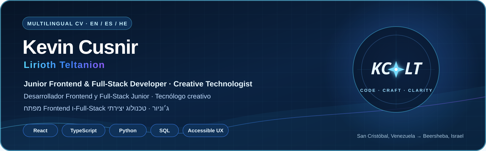

  

# Kevin Cusnir — Currículum Vitae

**Desarrollador Frontend y Full-Stack Junior · Tecnólogo creativo**

Beersheba, Israel  
Correo: [kevincusnir@gmail.com](mailto:kevincusnir@gmail.com)  
GitHub: [LiriothTeltanion](https://github.com/LiriothTeltanion)  
LinkedIn: [Kevin Cusnir](https://www.linkedin.com/in/kevin-cusnir-883173b4/)

## Perfil profesional

Desarrollador frontend y full-stack junior que crea productos con React, TypeScript, Python y SQL, con UX accesible y multilingüe, honestidad en los datos y automatización práctica. Mi trabajo incluye analítica musical local-first, una plataforma educativa desplegada con PostgreSQL y software de escritorio probado. **Lirioth Teltanion** es mi identidad creativa para proyectos que conectan ingeniería, música, narrativa visual e interfaces experimentales.

## Habilidades principales

- **Lenguajes:** TypeScript, JavaScript, Python y SQL
- **Frontend:** React, HTML5, CSS3, Vite, accesibilidad, internacionalización y UX RTL
- **Backend y datos:** FastAPI, fundamentos de Node.js, APIs REST, PostgreSQL, SQLite y Alembic
- **Calidad y entrega:** Vitest, Testing Library, pytest, pruebas de integración, logging estructurado, GitHub Actions y Docker
- **Flujo de trabajo:** Git, GitHub, GitHub Desktop Beta, entregas con documentación y revisión asistida por IA con verificación explícita
- **Adicional:** diagnóstico de Windows, reparación de computadoras y configuración de sistemas

## Proyectos seleccionados

### Nova Music Lab

Museo musical local-first en React y TypeScript que normaliza exportaciones de cinco ecosistemas de escucha para crear analítica consciente de la fuente, historias visuales y un archivo personal portátil. Incluye pruebas automatizadas, CI y presupuestos de bundle.

[Producto en vivo](https://liriothteltanion.github.io/NovaMusicLab/) · [Código](https://github.com/LiriothTeltanion/NovaMusicLab)

### Ivrit Sheli 2.12.3

Producto desplegado y trilingue para aprender hebreo con React, TypeScript, FastAPI, PostgreSQL, Alembic, Docker y Render. La base verificada de la version 2.12.3 contiene **859 pruebas de frontend + 387 de backend = 1.246 pruebas automatizadas**, ademas de una matriz Playwright multinavegador, tipado estricto con MyPy y Ruff, UX RTL nativa en hebreo y logging estructurado con redaccion de secretos verificada. El inicio de sesion con Google esta operativo; la prueba de aislamiento entre dos cuentas reales es lo unico que sigue figurando como no verificado.

[Producto en vivo](https://ivrit-sheli-staging.onrender.com) · [Código](https://github.com/LiriothTeltanion/IvritSheli)

### NovaFit 4.2.0

Estudio local-first de inteligencia de bienestar con Python, Tkinter y SQLite, perfiles aislados, analítica explicable, copias verificadas, 12 temas, soporte EN/ES/HE y una base documentada de **124 pruebas**.

[Demostración](https://liriothteltanion.github.io/NovaFit/) · [Código](https://github.com/LiriothTeltanion/NovaFit)

### Christopher Rodríguez Portfolio

Portafolio bilingüe y accesible en React y TypeScript creado para un educador y colaborador, con contenido estructurado, estados de verificación y entrega mediante GitHub Pages.

[Portafolio en vivo](https://liriothteltanion.github.io/ChristopherRodriguezCVOnline/) · [Código](https://github.com/LiriothTeltanion/ChristopherRodriguezCVOnline)

## Formación

**Programa de Desarrollo Full-Stack — Developers Institute, Israel**  
Ruta de JavaScript y Python · 2025–2026 · **En progreso**

El programa actual incluye Python, programación orientada a objetos, SQL, JavaScript, React, Redux, Node.js, Express, JWT, TypeScript, Git/GitHub y despliegue. No se afirma finalización, graduación ni certificación.

## Experiencia

**Isrotel, Eilat — Mesero y atención al huésped**  
2018–2019

- Atención al cliente en un entorno hotelero dinámico.
- Coordinación de equipo, precisión de pedidos y comunicación directa.

**Yarin Recursos Humanos / Servicios Operativos — Operaciones y limpieza**  
2022–2023

- Apoyo operativo confiable y cumplimiento de tareas.
- Trabajo en entornos estructurados con necesidades prácticas de servicio.

**Experiencia adicional de servicio — Beersheba**

- Apoyo y asistencia a adultos mayores.
- Comunicación práctica en español, inglés y hebreo.

## Idiomas

- Español — nativo
- Inglés — avanzado profesional
- Hebreo — nivel funcional para la vida y el trabajo local

## Dirección actual

Abierto a oportunidades junior en frontend, full-stack y tecnología creativa donde importen la mentoría, la revisión de código, los usuarios reales y la calidad del producto.
